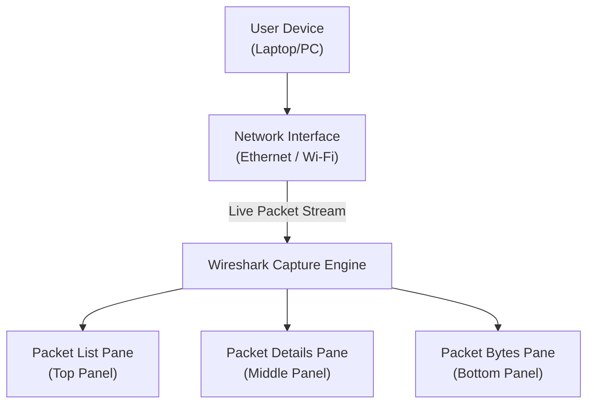

# Architectural Diagram — Wireshark Fundamentals Lab

This document illustrates the flow of how Wireshark captures and displays network traffic during this lab.

---

## 🏗️ High-Level Architecture Diagram

---

## 🔍 Component Breakdown

### **1. User Device**
Your computer generates traffic such as:
- Web browsing  
- DNS lookups  
- Application traffic  
- Background services  

This traffic flows through your network interface.

---

### **2. Network Interface (Ethernet or Wi‑Fi)**
Wireshark captures packets directly from the interface you select.  
The interface with the most activity is usually the correct one.

---

### **3. Wireshark Capture Engine**
Once capturing begins, Wireshark:
- Sniffs packets in real time  
- Timestamps each frame  
- Identifies protocols  
- Applies color rules  
- Stores packets in memory or a capture file  

---

### **4. Wireshark Interface Panels**

#### **Packet List Pane**
Shows each packet as a single row with:
- Timestamp  
- Source / Destination  
- Protocol  
- Length  
- Summary  

#### **Packet Details Pane**
Breaks down the selected packet by protocol layers:
- Frame  
- Ethernet  
- IP  
- TCP/UDP  
- Application layer (DNS, HTTP, TLS, etc.)

#### **Packet Bytes Pane**
Displays the raw packet in:
- Hexadecimal  
- ASCII  

---

## 🌐 Traffic Flow Summary
1. Your device generates or receives traffic.  
2. The network interface transmits packets.  
3. Wireshark captures packets in real time.  
4. Packets appear in the list pane.  
5. Selecting a packet reveals protocol details.  
6. Raw bytes are available for deep inspection.

---

## 🎯 Final Notes
This architecture shows how Wireshark interacts with your system to capture and analyze network traffic.  
Understanding this flow is essential for mastering packet
